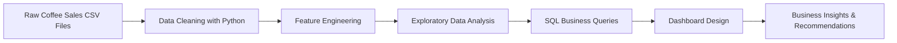

# ☕ Coffee Sales Analytics Project

### Turning Coffee Transactions into Business Growth Insights


---

## 📌 Project Overview

Coffee shops do not only sell coffee — they sell habits, routines, and daily customer experiences.

This project analyzes coffee sales transaction data from 2024 to 2025 to uncover business insights about revenue performance, product demand, customer purchasing behavior, payment preferences, and peak sales periods.

The goal is to transform raw transaction data into a business intelligence solution that helps a coffee retail business answer one important question:

> **How can we increase sales, improve product strategy, and better understand customer behavior using data?**

This project was built as a portfolio case study for Data Analyst, Business Analyst, and Business Intelligence Analyst roles.

---

## 🎯 Business Problem

A coffee retail business has daily transaction data but lacks a clear understanding of:

* Which coffee products generate the most revenue
* Which items customers buy most frequently
* When sales are strongest or weakest
* How customers prefer to pay
* Which customers purchase repeatedly
* What opportunities exist to increase revenue

Without analytics, the business may rely on assumptions when making decisions about promotions, inventory, staffing, pricing, and customer retention.

This project solves that problem by creating a structured analytics workflow using Python, SQL, and dashboard-ready business metrics.

---

## 🧠 Business Objectives

The main objectives of this project are to:

1. Measure overall sales performance across 2024 and 2025.
2. Identify best-selling and highest-revenue coffee products.
3. Analyze monthly, daily, and hourly sales patterns.
4. Understand customer payment behavior.
5. Explore repeat customer activity using anonymized card data.
6. Generate business recommendations to improve sales and customer retention.

---

## 🗂️ Dataset Description

The dataset contains transaction-level coffee sales data.

| Column        | Description                               |
| ------------- | ----------------------------------------- |
| `date`        | Date of the transaction                   |
| `datetime`    | Exact transaction timestamp               |
| `cash_type`   | Payment method used, such as cash or card |
| `card`        | Anonymized customer/card identifier       |
| `money`       | Transaction amount or sales revenue       |
| `coffee_name` | Name of coffee product purchased          |

### Dataset Notes

* The 2024 dataset includes anonymized card IDs.
* The 2025 dataset does not include the `card` column.
* Missing card values were retained because they represent valid sales transactions.
* Customer behavior analysis was performed only where card identifiers were available.

---

## 🛠️ Tools Used

| Tool                 | Purpose                                          |
| -------------------- | ------------------------------------------------ |
| Python               | Data cleaning, EDA, feature engineering          |
| Pandas               | Data manipulation and aggregation                |
| Matplotlib / Seaborn | Data visualization                               |
| SQL Server           | Business query analysis                          |
| Power BI / Tableau   | Dashboard design and KPI reporting               |
| Excel                | Initial review and validation                    |
| GitHub               | Project documentation and portfolio presentation |

---

## 🔄 Analytics Workflow



---

## 🧹 Data Cleaning Process

The data cleaning process included:

* Combined 2024 and 2025 coffee sales datasets
* Standardized column names
* Converted date and datetime fields into proper formats
* Converted revenue column into numeric format
* Checked missing values
* Retained missing card values for valid cash or non-card transactions
* Removed duplicate records
* Standardized product names with inconsistent capitalization
* Created new time-based fields:

  * Year
  * Month
  * Month Name
  * Day of Week
  * Hour
* Created product categories based on coffee type
* Exported a cleaned dataset for SQL and dashboard development

---

## 📊 Key Performance Indicators

| KPI                         | Business Meaning                                     |
| --------------------------- | ---------------------------------------------------- |
| Total Revenue               | Measures total sales generated                       |
| Total Orders                | Counts total transactions                            |
| Average Order Value         | Shows average customer spend per transaction         |
| Best-Selling Product        | Identifies the most frequently purchased coffee      |
| Highest-Revenue Product     | Identifies the product contributing the most revenue |
| Monthly Revenue             | Tracks sales performance over time                   |
| Month-over-Month Growth     | Measures revenue growth or decline                   |
| Peak Sales Day              | Identifies strongest day of the week                 |
| Peak Sales Hour             | Identifies busiest sales hour                        |
| Payment Type Share          | Compares cash and card usage                         |
| Repeat Customer Count       | Measures customer retention potential                |
| Customer Purchase Frequency | Shows how often customers return                     |

---

## 📈 Executive KPI Summary

| Metric                     |              Result |
| -------------------------- | ------------------: |
| Total Cleaned Transactions |               3,896 |
| Total Revenue              |          122,271.58 |
| Average Order Value        |               31.38 |
| Top Product by Orders      | Americano with Milk |
| Top Product by Revenue     |               Latte |
| Top Sales Month            |       February 2025 |
| Peak Sales Day             |             Tuesday |
| Peak Sales Hour            |               10 AM |
| Dominant Payment Method    |                Card |

---

## 🔍 Key Business Questions Answered

This analysis answers the following business questions:

1. How much total revenue did the business generate?
2. How many coffee transactions were recorded?
3. What is the average customer spend per order?
4. Which coffee product sells the most?
5. Which coffee product generates the highest revenue?
6. What month has the highest sales?
7. What day of the week performs best?
8. What hour of the day has the highest demand?
9. Do customers prefer cash or card payments?
10. Which customers purchase repeatedly?
11. Are sales increasing or decreasing over time?
12. What business strategies can improve revenue?

---

## 📊 Dashboard Design

The dashboard is designed to give business users a clear and executive-level view of coffee sales performance.

### Dashboard Sections

#### 1. KPI Cards

* Total Revenue
* Total Orders
* Average Order Value
* Best-Selling Product
* Highest-Revenue Product
* Card Payment Share

#### 2. Sales Trend Analysis

* Monthly revenue trend
* Month-over-month growth
* Sales seasonality

#### 3. Product Performance

* Top products by revenue
* Top products by number of orders
* Product category performance

#### 4. Customer Behavior

* Repeat customer count
* Purchase frequency
* Top spending card customers

#### 5. Time-Based Sales Analysis

* Sales by month
* Sales by day of week
* Sales by hour

#### 6. Business Recommendations

* Product strategy
* Promotion ideas
* Staffing and inventory suggestions
* Customer retention opportunities

---

## 🧾 SQL Analysis Examples

### Total Revenue, Orders, and Average Order Value

```sql
SELECT
    SUM(money) AS total_revenue,
    COUNT(*) AS total_orders,
    AVG(money) AS average_order_value
FROM coffee_sales_clean;
```

### Monthly Sales Trend

```sql
SELECT
    YEAR(sale_datetime) AS sales_year,
    MONTH(sale_datetime) AS sales_month,
    SUM(money) AS monthly_revenue,
    COUNT(*) AS monthly_orders
FROM coffee_sales_clean
GROUP BY
    YEAR(sale_datetime),
    MONTH(sale_datetime)
ORDER BY
    sales_year,
    sales_month;
```

### Top Products by Revenue

```sql
SELECT TOP 10
    coffee_name,
    SUM(money) AS total_revenue,
    COUNT(*) AS total_orders,
    AVG(money) AS average_order_value
FROM coffee_sales_clean
GROUP BY coffee_name
ORDER BY total_revenue DESC;
```

### Sales by Payment Type

```sql
SELECT
    cash_type,
    COUNT(*) AS total_orders,
    SUM(money) AS total_revenue,
    AVG(money) AS average_order_value
FROM coffee_sales_clean
GROUP BY cash_type
ORDER BY total_revenue DESC;
```

### Peak Sales Hour

```sql
SELECT
    DATEPART(HOUR, sale_datetime) AS sales_hour,
    COUNT(*) AS total_orders,
    SUM(money) AS total_revenue
FROM coffee_sales_clean
GROUP BY DATEPART(HOUR, sale_datetime)
ORDER BY total_revenue DESC;
```

---

## 🐍 Python Analysis Preview

```python
import pandas as pd
import matplotlib.pyplot as plt
import seaborn as sns

# Load datasets
coffee_2024 = pd.read_csv("Coffee_Sales_2024.csv")
coffee_2025 = pd.read_csv("Coffee_Sales_2025.csv")

# Combine datasets
df = pd.concat([coffee_2024, coffee_2025], ignore_index=True, sort=False)

# Clean column names
df.columns = df.columns.str.strip().str.lower()

# Convert date columns
df["date"] = pd.to_datetime(df["date"], errors="coerce")
df["datetime"] = pd.to_datetime(df["datetime"], errors="coerce", format="mixed")

# Convert revenue column
df["money"] = pd.to_numeric(df["money"], errors="coerce")

# Remove duplicates
df = df.drop_duplicates()

# Feature engineering
df["year_month"] = df["datetime"].dt.to_period("M").astype(str)
df["day_name"] = df["datetime"].dt.day_name()
df["hour"] = df["datetime"].dt.hour

# KPI calculation
total_revenue = df["money"].sum()
total_orders = len(df)
average_order_value = df["money"].mean()

print("Total Revenue:", total_revenue)
print("Total Orders:", total_orders)
print("Average Order Value:", average_order_value)
```

---

## 💡 Key Insights

### 1. Latte is the strongest revenue driver

Latte generated the highest total revenue, making it one of the most valuable products for the business.

**Business Meaning:**
The business should prioritize Latte in promotions, bundles, and upselling strategies.

---

### 2. Americano with Milk is the most frequently purchased product

Americano with Milk had the highest number of orders.

**Business Meaning:**
This product likely has strong customer demand and should remain consistently available.

---

### 3. Card payments dominate customer transactions

Most customers used card payments instead of cash.

**Business Meaning:**
The business can use card-based identifiers to support loyalty programs and repeat customer analysis.

---

### 4. Morning hours show strong sales activity

Sales activity peaks around 10 AM.

**Business Meaning:**
The business should prepare more inventory and staff support during morning demand periods.

---

### 5. Tuesday shows strong sales performance

Tuesday appeared as one of the strongest sales days.

**Business Meaning:**
Management can investigate what drives Tuesday performance and apply similar strategies to weaker days.

---

## 🚀 Business Recommendations

Based on the analysis, the coffee business can improve performance by applying the following strategies:

### 1. Promote high-performing products

Create campaigns around Latte and Americano with Milk because they already show strong demand.

### 2. Launch morning bundle offers

Since sales peak in the morning, offer coffee-and-snack bundles during high-demand hours.

### 3. Build a loyalty program

Use anonymized card-based customer activity to identify repeat customers and reward frequent buyers.

### 4. Improve inventory planning

Stock more ingredients for top-selling products during peak hours and high-performing days.

### 5. Strengthen weaker sales periods

Offer discounts or limited-time promotions during low-performing hours or days.

### 6. Review low-performing products

Products with consistently low sales should be evaluated for repositioning, bundling, or removal.

---

## 🧩 What Makes This Project Valuable

This project is not only about creating charts. It demonstrates the full analytics process:

* Understanding a realistic business problem
* Cleaning raw transaction data
* Creating business KPIs
* Writing SQL queries for analysis
* Performing Python-based EDA
* Designing an executive dashboard
* Translating data findings into business recommendations

This makes the project relevant for:

* Data Analyst roles
* Business Analyst roles
* Business Intelligence Analyst roles
* Reporting Analyst roles
* Junior Analytics roles

---

## 🧑‍💼 Journal Entry 

This project analyzes coffee sales transaction data to identify revenue trends, product performance, customer behavior, and sales opportunities.

I cleaned and combined multiple CSV files, handled missing values and duplicates, created new time-based features, and used Python and SQL to analyze sales performance. I also designed a dashboard structure with KPIs such as total revenue, total orders, average order value, best-selling product, highest-revenue product, peak sales hour, and customer purchase frequency.

The main business value of this project is that it helps a coffee business understand what products drive revenue, when customers buy the most, and how the company can improve sales through better promotions, inventory planning, and loyalty strategies.

---

## 📌 Final Conclusion

The Coffee Sales Intelligence Dashboard shows how raw sales transactions can be transformed into actionable business insights.

Through data cleaning, KPI development, SQL analysis, Python EDA, and dashboard planning, this project provides a complete view of coffee sales performance and customer behavior.

The analysis supports better decision-making in product strategy, customer retention, promotion planning, and revenue growth.

> **From coffee transactions to business decisions — this project turns everyday sales data into growth opportunities.**
